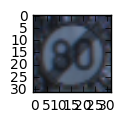
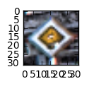
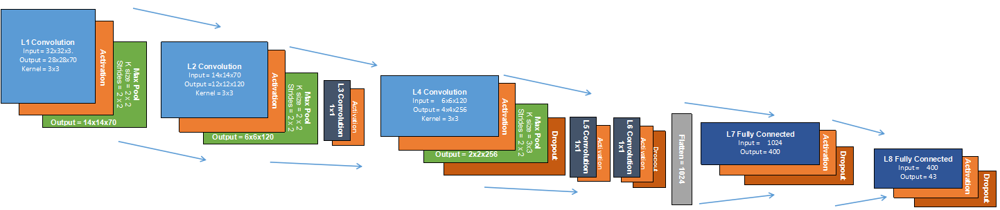
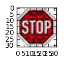
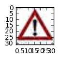
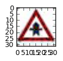
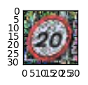
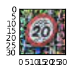

# Self-Driving Car Engineer Nanodegree

## Deep Learning

## Project: Build a Traffic Sign Recognition Classifier

In this notebook, a template is provided for you to implement your functionality in stages which is required to successfully complete this project. If additional code is required that cannot be included in the notebook, be sure that the Python code is successfully imported and included in your submission, if necessary. Sections that begin with **'Implementation'** in the header indicate where you should begin your implementation for your project. Note that some sections of implementation are optional, and will be marked with **'Optional'** in the header.

In addition to implementing code, there will be questions that you must answer which relate to the project and your implementation. Each section where you will answer a question is preceded by a **'Question'** header. Carefully read each question and provide thorough answers in the following text boxes that begin with **'Answer:'**. Your project submission will be evaluated based on your answers to each of the questions and the implementation you provide.

>**Note:** Code and Markdown cells can be executed using the **Shift + Enter** keyboard shortcut. In addition, Markdown cells can be edited by typically double-clicking the cell to enter edit mode.

---
## Step 0: Load The Data


```python
# Load pickled data
import pickle

# TODO: Fill this in based on where you saved the training and testing data

training_file = 'train.p'
testing_file = 'test.p'

with open(training_file, mode='rb') as f:
    train = pickle.load(f)
with open(testing_file, mode='rb') as f:
    test = pickle.load(f)
    
X_train, y_train = train['features'], train['labels']
X_test, y_test = test['features'], test['labels']

```

---

## Step 1: Dataset Summary & Exploration

The pickled data is a dictionary with 4 key/value pairs:

- `'features'` is a 4D array containing raw pixel data of the traffic sign images, (num examples, width, height, channels).
- `'labels'` is a 2D array containing the label/class id of the traffic sign. The file `signnames.csv` contains id -> name mappings for each id.
- `'sizes'` is a list containing tuples, (width, height) representing the the original width and height the image.
- `'coords'` is a list containing tuples, (x1, y1, x2, y2) representing coordinates of a bounding box around the sign in the image. **THESE COORDINATES ASSUME THE ORIGINAL IMAGE. THE PICKLED DATA CONTAINS RESIZED VERSIONS (32 by 32) OF THESE IMAGES**

Complete the basic data summary below.


```python
### Replace each question mark with the appropriate value.

# TODO: Number of training examples
n_train = X_train.shape[0]

# TODO: Number of testing examples.
n_test = X_test.shape[0]

# TODO: What's the shape of an traffic sign image?
image_shape = X_train[0].shape

# TODO: How many unique classes/labels there are in the dataset.
n_classes = 43

print("Number of training examples =", n_train)
print("Number of testing examples =", n_test)
print("Image data shape =", image_shape)
print("Number of classes =", n_classes)
```

    Number of training examples = 39209
    Number of testing examples = 12630
    Image data shape = (32, 32, 3)
    Number of classes = 43


Visualize the German Traffic Signs Dataset using the pickled file(s). This is open ended, suggestions include: plotting traffic sign images, plotting the count of each sign, etc.

The [Matplotlib](http://matplotlib.org/) [examples](http://matplotlib.org/examples/index.html) and [gallery](http://matplotlib.org/gallery.html) pages are a great resource for doing visualizations in Python.

**NOTE:** It's recommended you start with something simple first. If you wish to do more, come back to it after you've completed the rest of the sections.


```python
### Data exploration visualization goes here.
### Feel free to use as many code cells as needed.
import matplotlib.pyplot as plt
import random
# Visualizations will be shown in the notebook.
%matplotlib inline


index = random.randint(0, len(X_train))
image = X_train[index].squeeze()

plt.figure(figsize=(1,1))
plt.imshow(image)
print(y_train[index])
```

    6





----

## Step 2: Design and Test a Model Architecture

Design and implement a deep learning model that learns to recognize traffic signs. Train and test your model on the [German Traffic Sign Dataset](http://benchmark.ini.rub.de/?section=gtsrb&subsection=dataset).

There are various aspects to consider when thinking about this problem:

- Neural network architecture
- Play around preprocessing techniques (normalization, rgb to grayscale, etc)
- Number of examples per label (some have more than others).
- Generate fake data.

Here is an example of a [published baseline model on this problem](http://yann.lecun.com/exdb/publis/pdf/sermanet-ijcnn-11.pdf). It's not required to be familiar with the approach used in the paper but, it's good practice to try to read papers like these.

**NOTE:** The LeNet-5 implementation shown in the [classroom](https://classroom.udacity.com/nanodegrees/nd013/parts/fbf77062-5703-404e-b60c-95b78b2f3f9e/modules/6df7ae49-c61c-4bb2-a23e-6527e69209ec/lessons/601ae704-1035-4287-8b11-e2c2716217ad/concepts/d4aca031-508f-4e0b-b493-e7b706120f81) at the end of the CNN lesson is a solid starting point. You'll have to change the number of classes and possibly the preprocessing, but aside from that it's plug and play!

### Implementation

Use the code cell (or multiple code cells, if necessary) to implement the first step of your project. Once you have completed your implementation and are satisfied with the results, be sure to thoroughly answer the questions that follow.


```python
import tensorflow as tf

EPOCHS = 25
BATCH_SIZE = 128
```


```python
x = tf.placeholder(tf.float32, (None, 32, 32, 3))
y = tf.placeholder(tf.int32, (None))
one_hot_y = tf.one_hot(y, 43)
```

### Question 1 

_Describe how you preprocessed the data. Why did you choose that technique?_

**Answer:**
- Adaptative histogram equalization was applied, as decribed in Wikipedia:
    "Adaptive histogram equalization (AHE) is a computer image processing technique used to improve contrast in images. 
    It differs from ordinary histogram equalization in the respect that the adaptive method computes several histograms, 
    each corresponding to a distinct section of the image, and uses them to redistribute the lightness values of the 
    image. It is therefore suitable for improving the local contrast and enhancing the definitions of edges in each 
    region of an image."
    https://en.wikipedia.org/wiki/Adaptive_histogram_equalization
 - Therefore that makes better pictures that are clearer.

- I also applied random rotations in order to simulate situation where the camera detects the signs from a different angle. It also proved to improve the results.


```python
### Preprocess the data here.
### Feel free to use as many code cells as needed.
from sklearn.model_selection import train_test_split

#Splitting training into training and validation
X_train, X_validation, y_train, y_validation =  train_test_split(X_train,  y_train, test_size=0.2, random_state=42)

```


```python
### Generate data additional data (OPTIONAL!)
### and split the data into training/validation/testing sets here.
### Feel free to use as many code cells as needed.


from sklearn.utils import shuffle
from scipy import ndimage
from skimage import exposure
import numpy as np

#Shuffle training data
X_train, y_train = shuffle(X_train, y_train)


#Temp auxiliar vector for data augmentation
aux=[]


#Applying equalizer to validation set
for image in X_train:
    image = exposure.equalize_adapthist(image, clip_limit=0.03)
    aux.append(image)
    
X_train =np.array(aux)  

#Creating a copy of training set in order to apply data augmentation
X_train2, y_train2 = X_train, y_train

#Creating a second dataset with random rotations
aux=[]
for image in X_train2:
    randomNumber=random.randint(0,5)
    if randomNumber>= 3:
        image = ndimage.rotate(image, random.randint(-10,10), reshape=False)
    elif randomNumber < 3:
        image = ndimage.rotate(image, random.randint(-45,45), reshape=False)
    aux.append(image)
    
X_train2 =np.array(aux)  

#Visualizing a sample picture after equalization
index = random.randint(0, len(X_train))
sample_img = X_train[index].squeeze()
plt.figure(figsize=(1,1))
plt.imshow(sample_img)

#Applying equalizer to validation set
aux=[]
for image in X_validation:
    image = exposure.equalize_adapthist(image, clip_limit=0.03)
    aux.append(image)
    
X_validation =np.array(aux) 

#Applying equalizer to test set
aux=[]
for image in X_test:
    image = exposure.equalize_adapthist(image, clip_limit=0.03)
    aux.append(image)

X_test=np.array(aux)
```

    /home/israel/anaconda3/envs/CarND-Traffic-Sign-Classifier-Project/lib/python3.5/site-packages/skimage/util/dtype.py:110: UserWarning: Possible precision loss when converting from float64 to uint16
      "%s to %s" % (dtypeobj_in, dtypeobj))





### Question 2

_Describe how you set up the training, validation and testing data for your model. **Optional**: If you generated additional data, how did you generate the data? Why did you generate the data? What are the differences in the new dataset (with generated data) from the original dataset?_

**Answer:**
- The training set was splitted in order to create an evaluation set.
- As described in the 1st question, the contrast of the pictures was improved with adaptative histogram equalization, this was applied to the training, validation y test datasets.
- A copy of trainign was created with adding random rotation in the pictures (also described in 1st question)


```python
### Define your architecture here.
### Feel free to use as many code cells as needed.


from tensorflow.contrib.layers import flatten


keep_prob = tf.placeholder(tf.float32) 

def LeNet(x, train=False):    
    # Hyperparameters
    mu = 0
    sigma = 0.1
    
    #Normalizing input data
    x=tf.nn.l2_normalize(x, 0, epsilon=1e-12, name=None)
    
    
    # Layer 1: Convolutional. Input = 32x32x3. Output = 28x28x70.
    conv1_W = tf.Variable(tf.truncated_normal(shape=(5, 5, 3, 70), mean = mu, stddev = sigma))
    conv1_b = tf.Variable(tf.zeros(70))
    conv1   = tf.nn.conv2d( x, conv1_W, strides=[1, 1, 1, 1], padding='VALID') + conv1_b
    # Activation.
    conv1 = tf.nn.elu(conv1)
    # Pooling. Input = 28x28x70. Output = 14x14x70.
    conv1 = tf.nn.max_pool(conv1, ksize=[1, 2, 2, 1], strides=[1, 2, 2, 1], padding='VALID')
    
    


    # Layer 2: Convolutional. Input = 14x14x70  Output = 12x12x120.
    conv2_W = tf.Variable(tf.truncated_normal(shape=(3, 3, 70, 120), mean = mu, stddev = sigma))
    conv2_b = tf.Variable(tf.zeros(120))
    conv2   = tf.nn.conv2d(conv1, conv2_W, strides=[1, 1, 1, 1], padding='VALID') + conv2_b
    # Activation.
    conv2 = tf.nn.elu(conv2)
    # Pooling. Input = 12x12x120. Output = 6x6x120.
    conv2 = tf.nn.max_pool(conv2, ksize=[1, 2, 2, 1], strides=[1, 2, 2, 1], padding='VALID')
    
    
    
    
     # Layer 3 1x1: Convolutional. Input = 6x6x120  Output = 6x6x120.
    conv1x1_W = tf.Variable(tf.truncated_normal(shape=(1, 1, 120, 120), mean = mu, stddev = sigma))
    conv1x1_b = tf.Variable(tf.zeros(120))
    conv1x1   = tf.nn.conv2d(conv2, conv1x1_W, strides=[1, 1, 1, 1], padding='VALID') + conv1x1_b
    # Activation.
    conv1x1 = tf.nn.elu(conv1x1)
    
    
    # Layer 4: Convolutional. Input = 6x6x120   Output = 4x4x256.
    conv3_W = tf.Variable(tf.truncated_normal(shape=(3, 3, 120, 256), mean = mu, stddev = sigma))
    conv3_b = tf.Variable(tf.zeros(256))
    conv3   = tf.nn.conv2d(conv1x1, conv3_W, strides=[1, 1, 1, 1], padding='VALID') + conv3_b
    # Activation.
    conv3 = tf.nn.elu(conv3)
    # SOLUTION: Pooling. Input = 4x4x256. Output = 2x2x256.
    conv3 = tf.nn.max_pool(conv3, ksize=[1, 2, 2, 1], strides=[1, 2, 2, 1], padding='VALID')
    conv3 = tf.nn.dropout(conv3, keep_prob)
    
    
    # Layer 5 1x1: Convolutional. Input = 2x2x256  Output = 2x2x256.
    conv1x_W = tf.Variable(tf.truncated_normal(shape=(1, 1, 256, 256), mean = mu, stddev = sigma))
    conv1x_b = tf.Variable(tf.zeros(256))
    conv1x   = tf.nn.conv2d(conv3, conv1x_W, strides=[1, 1, 1, 1], padding='VALID') + conv1x_b
    # Activation.
    conv1x = tf.nn.elu(conv1x)
    
    # Layer 6 1x1: Convolutional. Input = 2x2x256  Output = 2x2x256.
    conv2x_W = tf.Variable(tf.truncated_normal(shape=(1, 1, 256, 256), mean = mu, stddev = sigma))
    conv2x_b = tf.Variable(tf.zeros(256))
    conv2x   = tf.nn.conv2d(conv1x, conv2x_W, strides=[1, 1, 1, 1], padding='VALID') + conv2x_b
    # Activation.
    conv2x = tf.nn.elu(conv2x)
    conv2x = tf.nn.dropout(conv2x, keep_prob)

    
    # Flatten:  Input = 2x2x256  Output = 1024.
    fc0  = flatten(conv1x)
    
    # Layer 7: Fully Connected. Input = 1024. Output = 400.
    fc1_W = tf.Variable(tf.truncated_normal(shape=(1024, 400), mean = mu, stddev = sigma))
    fc1_b = tf.Variable(tf.zeros(400))
    fc1   = tf.matmul(fc0, fc1_W) + fc1_b
    # Activation.
    fc1    = tf.nn.elu(fc1)
    #fc1 dropout
    fc1 = tf.nn.dropout(fc1, keep_prob)

    
    
    # Layer 8: Fully Connected. Input = 400. Output = 43.
    fc2_W  = tf.Variable(tf.truncated_normal(shape=(400, 43), mean = mu, stddev = sigma))
    fc2_b  = tf.Variable(tf.zeros(43))
    fc2_W = tf.nn.dropout(fc2_W, keep_prob)
    logits = tf.matmul(fc1, fc2_W) + fc2_b
    #logits = tf.nn.dropout(logits, keep_prob)
    
    #losses = tf.nn.l2_loss(conv1_W) + tf.nn.l2_loss(conv2_W) + tf.nn.l2_loss(conv3_W) + tf.nn.l2_loss(conv3x_W) + tf.nn.l2_loss(conv2x_W) + tf.nn.l2_loss(conv1x_W) + tf.nn.l2_loss(fc1_W) + tf.nn.l2_loss(fc3_W)
    #losses += tf.nn.l2_loss(conv1_b) + tf.nn.l2_loss(conv2_b) + tf.nn.l2_loss(conv3_b) + tf.nn.l2_loss(conv3x_b) + tf.nn.l2_loss(conv2x_b) + tf.nn.l2_loss(conv1x_b) + tf.nn.l2_loss(fc1_b) + tf.nn.l2_loss(fc3_b)
    
    return logits
```


```python
rate = 0.001

logits = LeNet(x)
cross_entropy = tf.nn.softmax_cross_entropy_with_logits(logits, one_hot_y)
loss_operation = tf.reduce_mean(cross_entropy )
optimizer = tf.train.AdamOptimizer(learning_rate = rate)
training_operation = optimizer.minimize(loss_operation)
```


```python
correct_prediction = tf.equal(tf.argmax(logits, 1), tf.argmax(one_hot_y, 1))
accuracy_operation = tf.reduce_mean(tf.cast(correct_prediction, tf.float32))


def evaluate(X_data, y_data):
    num_examples = len(X_data)
    total_accuracy = 0
    sess = tf.get_default_session()
    for offset in range(0, num_examples, BATCH_SIZE):
        batch_x, batch_y = X_data[offset:offset+BATCH_SIZE], y_data[offset:offset+BATCH_SIZE]
        accuracy = sess.run(accuracy_operation, feed_dict={x: batch_x, y: batch_y, keep_prob: 1.0})
        total_accuracy += (accuracy * len(batch_x))
    return total_accuracy / num_examples
```

### Question 3

_What does your final architecture look like? (Type of model, layers, sizes, connectivity, etc.)  For reference on how to build a deep neural network using TensorFlow, see [Deep Neural Network in TensorFlow
](https://classroom.udacity.com/nanodegrees/nd013/parts/fbf77062-5703-404e-b60c-95b78b2f3f9e/modules/6df7ae49-c61c-4bb2-a23e-6527e69209ec/lessons/b516a270-8600-4f93-a0a3-20dfeabe5da6/concepts/83a3a2a2-a9bd-4b7b-95b0-eb924ab14432) from the classroom._


**Answer:**



```python
### Train your model here.
### Feel free to use as many code cells as needed.

with tf.Session() as sess:
    sess.run(tf.global_variables_initializer())
    num_examples = len(X_train)
    
    print("Training...")
    print()
    for i in range(EPOCHS):
        X_train_rot, y_train_rot = shuffle(X_train2, y_train2)
        for offset in range(0, num_examples, BATCH_SIZE):
            end = offset + BATCH_SIZE
            batch_x, batch_y = X_train_rot[offset:end], y_train_rot[offset:end]
            sess.run(training_operation, feed_dict={x: batch_x, y: batch_y, keep_prob: 0.5})
            
        validation_accuracy = evaluate(X_validation, y_validation)
        print("EPOCH {} ...".format(i+1))
        print("Validation Accuracy = {:.3f}".format(validation_accuracy))
        print()
        if round(validation_accuracy, 3)>=0.991:
            break
            
    logits1 = logits
    
    for i in range(EPOCHS):
        X_train_eq, y_train_eq = shuffle(X_train, y_train)
        for offset in range(0, num_examples, BATCH_SIZE):
            end = offset + BATCH_SIZE
            batch_x, batch_y = X_train_eq[offset:end], y_train_eq[offset:end]
            sess.run(training_operation, feed_dict={x: batch_x, y: batch_y, keep_prob: 0.5})
            
        validation_accuracy = evaluate(X_validation, y_validation)
        print("EPOCH {} ...".format(i+1))
        print("Validation Accuracy = {:.3f}".format(validation_accuracy))
        print()
        if round(validation_accuracy, 3)>=0.995:
            break
    
    logits = (logits + logits1) /2    
    
    try:
        saver
    except NameError:
        saver = tf.train.Saver()
    saver.save(sess, 'lenet')
    print("Model saved")
```

    Training...
    
    EPOCH 1 ...
    Validation Accuracy = 0.779
    
    EPOCH 2 ...
    Validation Accuracy = 0.939
    
    EPOCH 3 ...
    Validation Accuracy = 0.960
    
    EPOCH 4 ...
    Validation Accuracy = 0.970
    
    EPOCH 5 ...
    Validation Accuracy = 0.974
    
    EPOCH 6 ...
    Validation Accuracy = 0.979
    
    EPOCH 7 ...
    Validation Accuracy = 0.979
    
    EPOCH 8 ...
    Validation Accuracy = 0.984
    
    EPOCH 9 ...
    Validation Accuracy = 0.988
    
    EPOCH 10 ...
    Validation Accuracy = 0.989
    
    EPOCH 11 ...
    Validation Accuracy = 0.990
    
    EPOCH 12 ...
    Validation Accuracy = 0.990
    
    EPOCH 13 ...
    Validation Accuracy = 0.988
    
    EPOCH 14 ...
    Validation Accuracy = 0.988
    
    EPOCH 15 ...
    Validation Accuracy = 0.981
    
    EPOCH 16 ...
    Validation Accuracy = 0.988
    
    EPOCH 17 ...
    Validation Accuracy = 0.988
    
    EPOCH 18 ...
    Validation Accuracy = 0.991
    
    EPOCH 1 ...
    Validation Accuracy = 0.992
    
    EPOCH 2 ...
    Validation Accuracy = 0.994
    
    EPOCH 3 ...
    Validation Accuracy = 0.994
    
    EPOCH 4 ...
    Validation Accuracy = 0.994
    
    EPOCH 5 ...
    Validation Accuracy = 0.995
    
    Model saved


```python
with tf.Session() as sess:
    #sess.run(tf.global_variables_initializer())
    loader = tf.train.import_meta_graph('lenet.meta')
    loader.restore(sess, tf.train.latest_checkpoint('./'))

    test_accuracy = evaluate(X_test, y_test)
    #sess.run(test_accuracy)
    print("Test Accuracy = {:.3f}".format(test_accuracy))
    
```

    Test Accuracy = 0.977


### Question 4

_How did you train your model? (Type of optimizer, batch size, epochs, hyperparameters, etc.)_


**Answer:**
- I chose ELU instead of RELU due to its slightly better perfomance.
- I did try with other optimizer but it did not give a good result, so I kept AdamOptimizer.
- After some training, a good batch size was 128.
- I chose 25 epochs but I also assigned an early termination with a max value according to the learning improvement that I noticed.
- The right learning_rate is 0.001, a greater value messes up the training and a lower values does not really improve it.
- I also used two training session, one after another, with both dataset equalized but one of them with random rotations. I realized that this way the result improved in comparison to use only one of them (these are described in question one and two).

### Question 5


_What approach did you take in coming up with a solution to this problem? It may have been a process of trial and error, in which case, outline the steps you took to get to the final solution and why you chose those steps. Perhaps your solution involved an already well known implementation or architecture. In this case, discuss why you think this is suitable for the current problem._

**Answer:**
- It was mainly a trial and error process since I did not reall have a deep knowledge of DNN/CNN. I started with the architecture of LeNet provided in the lectures and started tunning the layers and hyperparameters in order to get a better prediction. At some point I researched for papers related to CNN and also solutions specificly applied to this well known problem and took some ideas, but I definitely did not want to simply copy one architecture, I better created my own solution.

---

## Step 3: Test a Model on New Images

Take several pictures of traffic signs that you find on the web or around you (at least five), and run them through your classifier on your computer to produce example results. The classifier might not recognize some local signs but it could prove interesting nonetheless.

You may find `signnames.csv` useful as it contains mappings from the class id (integer) to the actual sign name.

### Implementation

Use the code cell (or multiple code cells, if necessary) to implement the first step of your project. Once you have completed your implementation and are satisfied with the results, be sure to thoroughly answer the questions that follow.


```python
### Load the images and plot them here.
### Feel free to use as many code cells as needed.

from skimage import io

## Load new pics image collection
new_pics_x = io.imread_collection('./new_pics/*.jpg')
new_pics_x = np.array(io.concatenate_images(new_pics_x))
## These are the labels for the new images
new_pics_y = np.array([14, 18, 3, 11, 0, 0, 39 ])

aux=[]
for image in new_pics_x:
    image = exposure.equalize_adapthist(image, clip_limit=0.03)
    aux.append(image)

new_pics_x=np.array(aux)
```

    /home/israel/anaconda3/envs/CarND-Traffic-Sign-Classifier-Project/lib/python3.5/site-packages/skimage/util/dtype.py:110: UserWarning: Possible precision loss when converting from float64 to uint16
      "%s to %s" % (dtypeobj_in, dtypeobj))


### Question 6

_Choose five candidate images of traffic signs and provide them in the report. Are there any particular qualities of the image(s) that might make classification difficult? It could be helpful to plot the images in the notebook._


**Answer:**
- The speed limit signs may be difficult as per my experience, due to the similitudes among the other speed limit signs and, the "noise" surrounding the sign and also due to the angle in which there were taken. Many of the signs for label 0 have extra "noise" (a part of a sign above it is visible in the pic). However it is expected that random rotation in the pre processing improve the results.


```python
### Run the predictions here.
### Feel free to use as many code cells as needed.


# Visualizations will be shown in the notebook.
%matplotlib inline

#Visualizing the pictures
for image, label in zip(new_pics_x, new_pics_y):
    image = image.squeeze()
    plt.figure(figsize=(1,1))
    plt.imshow(image)
    print(label)
```

    14
    18
    3
    11
    0
    0
    39

















### Question 7

_Is your model able to perform equally well on captured pictures when compared to testing on the dataset? The simplest way to do this check the accuracy of the predictions. For example, if the model predicted 1 out of 5 signs correctly, it's 20% accurate._

_**NOTE:** You could check the accuracy manually by using `signnames.csv` (same directory). This file has a mapping from the class id (0-42) to the corresponding sign name. So, you could take the class id the model outputs, lookup the name in `signnames.csv` and see if it matches the sign from the image._


**Answer:**
- It performs well in comparison to test dataset. Of course the percentage is lower since one single failure has more impact due to the number of samples. The result and more detail is displayed below


```python
### Visualize the softmax probabilities here.
### Feel free to use as many code cells as needed.

with tf.Session() as sess:
    #sess.run(tf.global_variables_initializer())
    loader = tf.train.import_meta_graph('lenet.meta')
    loader.restore(sess, tf.train.latest_checkpoint('./'))

    test_accuracy = evaluate(new_pics_x, new_pics_y)
    print("Test Accuracy = {:.3f}".format(test_accuracy))
```

    Test Accuracy = 0.857


### Question 8

*Use the model's softmax probabilities to visualize the **certainty** of its predictions, [`tf.nn.top_k`](https://www.tensorflow.org/versions/r0.12/api_docs/python/nn.html#top_k) could prove helpful here. Which predictions is the model certain of? Uncertain? If the model was incorrect in its initial prediction, does the correct prediction appear in the top k? (k should be 5 at most)*

`tf.nn.top_k` will return the values and indices (class ids) of the top k predictions. So if k=3, for each sign, it'll return the 3 largest probabilities (out of a possible 43) and the correspoding class ids.

Take this numpy array as an example:

```
# (5, 6) array
a = np.array([[ 0.24879643,  0.07032244,  0.12641572,  0.34763842,  0.07893497,
         0.12789202],
       [ 0.28086119,  0.27569815,  0.08594638,  0.0178669 ,  0.18063401,
         0.15899337],
       [ 0.26076848,  0.23664738,  0.08020603,  0.07001922,  0.1134371 ,
         0.23892179],
       [ 0.11943333,  0.29198961,  0.02605103,  0.26234032,  0.1351348 ,
         0.16505091],
       [ 0.09561176,  0.34396535,  0.0643941 ,  0.16240774,  0.24206137,
         0.09155967]])
```

Running it through `sess.run(tf.nn.top_k(tf.constant(a), k=3))` produces:

```
TopKV2(values=array([[ 0.34763842,  0.24879643,  0.12789202],
       [ 0.28086119,  0.27569815,  0.18063401],
       [ 0.26076848,  0.23892179,  0.23664738],
       [ 0.29198961,  0.26234032,  0.16505091],
       [ 0.34396535,  0.24206137,  0.16240774]]), indices=array([[3, 0, 5],
       [0, 1, 4],
       [0, 5, 1],
       [1, 3, 5],
       [1, 4, 3]], dtype=int32))
```

Looking just at the first row we get `[ 0.34763842,  0.24879643,  0.12789202]`, you can confirm these are the 3 largest probabilities in `a`. You'll also notice `[3, 0, 5]` are the corresponding indices.


```python
softmax_prob = tf.nn.softmax(logits)
analyze_prediction = tf.nn.top_k(softmax_prob,k=5)

with tf.Session() as sess:
    
    loader = tf.train.import_meta_graph('lenet.meta')
    loader.restore(sess, tf.train.latest_checkpoint('./'))
    
    result= sess.run(analyze_prediction, feed_dict={x: new_pics_x, keep_prob: 1.0})
    print(result)
    

```

    TopKV2(values=array([[  1.00000000e+00,   6.61333424e-22,   2.36539046e-22,
              1.82361468e-26,   7.04956766e-27],
           [  1.00000000e+00,   0.00000000e+00,   0.00000000e+00,
              0.00000000e+00,   0.00000000e+00],
           [  1.00000000e+00,   7.74026503e-12,   2.57123072e-13,
              1.34087204e-14,   1.18607610e-15],
           [  1.00000000e+00,   3.25684981e-13,   8.77288032e-15,
              1.18839040e-15,   1.04357085e-15],
           [  9.25975144e-01,   6.42549992e-02,   6.10099407e-03,
              2.31874920e-03,   1.32016768e-03],
           [  9.91974890e-01,   3.94156063e-03,   3.59344180e-03,
              3.30875599e-04,   1.07546279e-04],
           [  1.00000000e+00,   1.51473651e-22,   6.61753818e-25,
              4.88173567e-26,   1.24016195e-27]], dtype=float32), indices=array([[14,  3, 29,  4, 35],
           [18,  0,  1,  2,  3],
           [ 3, 38,  5, 29,  2],
           [11, 16, 30, 27, 40],
           [ 0,  8,  3, 34, 35],
           [ 1, 29,  0, 21,  8],
           [39, 33, 37, 40, 20]], dtype=int32))


**Answer:**
- There are two signs for speed limit of 20, the first of them was properly recognized with a high value of confidence ([ 0,  8,  3, 34, 35] zero is the correct value), the second one failed  at the first attemp, however the correct predicion appears within the top 5 values (the third most probably [ 1, 29,  0, 21,  8]). This, as suggested in my previous comment, might be caused by the noise surrounding the picture, the angle in which the picture was taken or  the similarities among the different speed limit signs. All other signs were recognized with a high level of confidence.

- Perhaps an adjustment in dropout values is neccesary in order to increase/reduce generalization/overfitting a little bit. Also another preprocessing in the pictures in order to clean the "noise" surrounding the signs (I tried a black mask filter but did do better).

> **Note**: Once you have completed all of the code implementations and successfully answered each question above, you may finalize your work by exporting the iPython Notebook as an HTML document. You can do this by using the menu above and navigating to  \n",
    "**File -> Download as -> HTML (.html)**. Include the finished document along with this notebook as your submission.
